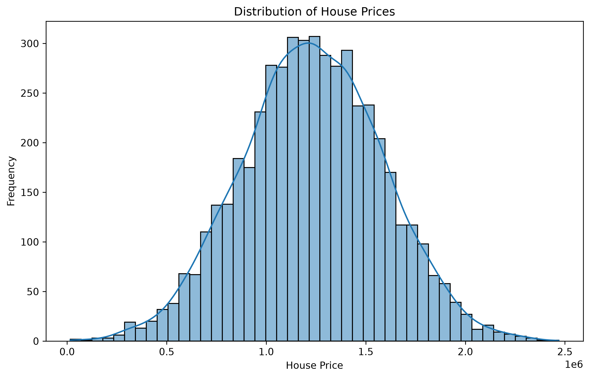
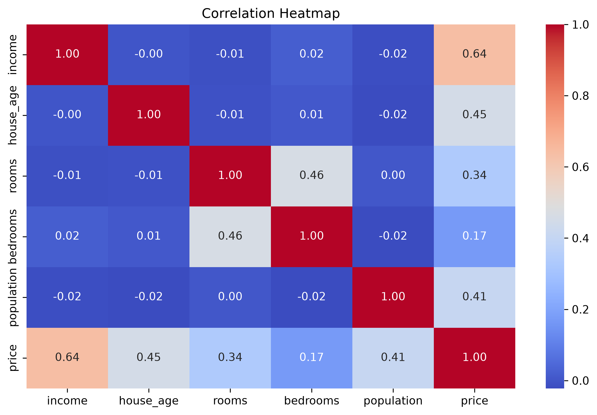
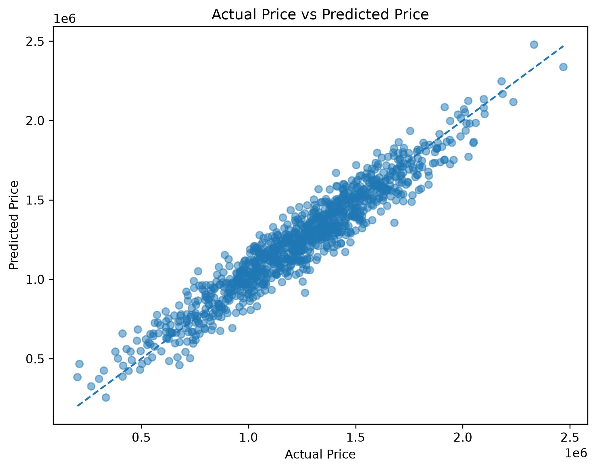
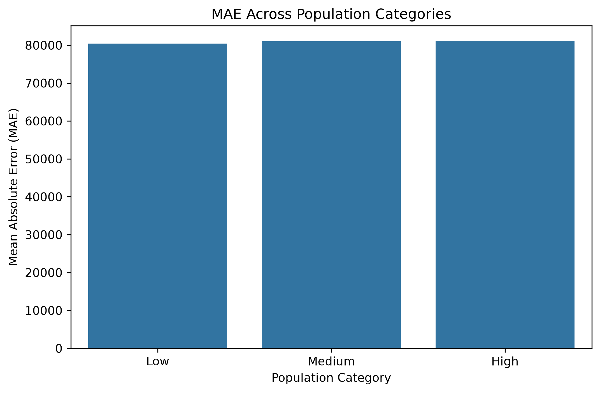

# 🏠 House Price Prediction

A Machine Learning project that predicts house prices using **Linear Regression** on the **USA Housing Dataset**.

The project demonstrates an end-to-end machine learning workflow including data preprocessing, exploratory data analysis, feature selection, model training, evaluation, model serialization, and deployment using **Streamlit**.

---

## 🌐 Live Demo

The House Price Prediction application is deployed using Streamlit Community Cloud.

**Live Application:**  
https://house-price-prediction-sp.streamlit.app/

Users can enter property information through the interactive web interface and receive an estimated house price generated by the trained Linear Regression model.

---

## 📌 Project Overview

The objective of this project is to build a machine learning regression model that can estimate house prices using relevant property and surrounding-area characteristics.

The project follows the complete machine learning pipeline:

1. Data loading
2. Data exploration
3. Data cleaning
4. Exploratory Data Analysis (EDA)
5. Feature analysis
6. Feature selection
7. Feature and target separation
8. Train-test splitting
9. Feature scaling
10. Linear Regression model training
11. Model evaluation
12. Actual vs Predicted analysis
13. Population-category performance analysis
14. Model serialization
15. Streamlit web application development
16. Deployment

---

## 📊 Dataset

The project uses the **USA Housing Dataset**.

The original dataset contains the following main numerical features:

| Feature | Description |
|---|---|
| Avg. Area Income | Average income associated with the area |
| Avg. Area House Age | Average age of houses |
| Avg. Area Number of Rooms | Average number of rooms |
| Avg. Area Number of Bedrooms | Average number of bedrooms |
| Area Population | Population of the area |
| Price | House price and target variable |

The original dataset also contains an `Address` column, which is not used for model training.

The dataset is stored inside:

```text
Dataset/USA_Housing.csv
```

---

## 🧹 Data Preprocessing

Before training the model, the dataset was inspected and prepared for machine learning.

The preprocessing workflow includes:

- Inspecting dataset dimensions
- Inspecting column information and data types
- Checking descriptive statistics
- Checking for missing values
- Checking for duplicate records
- Checking invalid values
- Removing unnecessary non-predictive information
- Renaming columns for simpler handling
- Separating features and the target variable
- Splitting data into training and testing sets
- Standardizing the selected input features

---

## 🔍 Exploratory Data Analysis

Exploratory Data Analysis was performed to understand the structure of the dataset and relationships between the variables.

### House Price Distribution

The distribution of house prices was analyzed using a histogram and density curve.



### Correlation Heatmap

A correlation heatmap was created to analyze the relationships between numerical features and house prices.



The analysis shows that **Income** has one of the strongest positive relationships with house price among the available features.

Scatter plots were also analyzed to understand the relationship between individual input features and the target variable.

---

## 🎯 Feature Selection

Feature analysis was performed before finalizing the input variables used by the Linear Regression model.

An earlier version of the model included:

- Income
- House Age
- Number of Rooms
- Number of Bedrooms
- Population
- Rooms per Bedroom

The engineered **Rooms per Bedroom** feature showed very little additional predictive contribution.

The **Bedrooms** feature also showed a comparatively small contribution to the model.

Instead of removing Bedrooms based only on its coefficient, the model was retrained and evaluated without it using the same train-test split and preprocessing steps.

Removing Bedrooms and Rooms per Bedroom did not reduce predictive performance. The evaluation metrics improved slightly while the model became simpler.

Therefore, both features were excluded from the final model.

### Final Selected Features

The final Linear Regression model uses **4 input features**:

1. Income
2. House Age
3. Number of Rooms
4. Population

This reduces unnecessary model complexity while maintaining strong predictive performance.

---

## 🤖 Machine Learning Model

The machine learning algorithm used in this project is:

### Linear Regression

Linear Regression was selected because the target variable, **house price**, is continuous and the dataset shows meaningful relationships between the selected input features and the target.

The model learns a linear relationship between the input features and house price.

---

## ✂️ Train-Test Split

The dataset was divided into training and testing sets using:

```text
Training Data: 80%
Testing Data: 20%
Random State: 42
```

The training data is used to train the Linear Regression model.

The testing data is kept separate and is used to evaluate how well the trained model performs on unseen data.

Using a separate testing set provides a more reliable estimate of model performance than evaluating the model only on the training data.

---

## ⚙️ Feature Scaling

Feature scaling was applied using **StandardScaler** from Scikit-learn.

The scaler is fitted only on the training data:

```python
scaler.fit(X_train)
```

The same fitted scaler is then used to transform:

- Training data
- Testing data
- User input received through the Streamlit application

This prevents data leakage and ensures that new inputs are processed consistently with the training data.

The trained scaler is saved as:

```text
Model/scaler.pkl
```

---

## 📈 Model Evaluation

The final model was evaluated using common regression metrics:

- **R² Score — Coefficient of Determination**
- **MAE — Mean Absolute Error**
- **MSE — Mean Squared Error**
- **RMSE — Root Mean Squared Error**

### Final Model Performance

| Metric | Result |
|---|---:|
| R² Score | **0.9181** |
| MAE | **80,857.79** |
| RMSE | **100,367.93** |

The model achieved an **R² score of approximately 0.9181**.

This means that the model explains approximately **91.81% of the variation in house prices** in the test data.

The final 4-feature model maintained strong predictive performance while being simpler than the previous model.

---

## 📉 Actual vs Predicted Prices

The following graph compares the actual house prices with the prices predicted by the model.



Predictions located closer to the reference line indicate better agreement between actual and predicted house prices.

The visualization shows that the Linear Regression model generally follows the actual price trend.

---

## 👥 Population Category Analysis

Additional analysis was performed to determine whether model performance changes across different population levels.

Population values were divided into three categories:

- Low
- Medium
- High

The categories were created using quantile-based grouping so that the dataset was divided into approximately equal-sized population groups.

The Mean Absolute Error was then calculated separately for each population category.



The analysis helps determine whether the model maintains consistent predictive performance across areas with different population levels.

The population category is used for analysis and display purposes and is **not an additional input feature used to train the Linear Regression model**.

---

## 💻 Streamlit Web Application

An interactive web application was developed using **Streamlit**.

The application allows users to enter property information and receive an estimated house price from the trained machine learning model.

### User Inputs

The final application accepts four inputs:

- **Annual Income ($)**
- **House Age (Years)**
- **Number of Rooms**
- **Area Population**

For a more practical user experience, discrete property characteristics such as **House Age** and **Number of Rooms** are entered as whole numbers.

### Application Output

The application displays:

- **Estimated House Price**
- **Population Category — Low, Medium, or High**

The application also validates the input fields before performing a prediction.

---

## 🗂️ Project Structure

```text
House-Price-Prediction/
│
├── Dataset/
│   └── USA_Housing.csv
│
├── Images/
│   ├── actual_vs_predicted.png
│   ├── correlation_heatmap.png
│   ├── population_category_mae.png
│   └── price_distribution.png
│
├── Model/
│   ├── linear_regression_model.pkl
│   └── scaler.pkl
│
├── Notebook/
│   └── House_Price_Prediction.ipynb
│
├── app.py
├── requirements.txt
└── README.md
```

---

## 📁 File Description

### `Notebook/House_Price_Prediction.ipynb`

Contains the complete machine learning workflow, including:

- Data loading
- Data inspection
- Data preprocessing
- Exploratory Data Analysis
- Correlation analysis
- Feature analysis
- Feature selection
- Train-test splitting
- Feature scaling
- Linear Regression training
- Coefficient analysis
- Model evaluation
- Actual vs Predicted visualization
- Population-category analysis
- Model and scaler serialization

The final trained model and scaler are saved directly from the notebook.

---

### `app.py`

Contains the Streamlit web application.

It:

- Loads the trained Linear Regression model
- Loads the saved StandardScaler
- Accepts four user inputs
- Validates the input values
- Creates the model input in the correct feature order
- Standardizes the input using the saved scaler
- Generates the house price prediction
- Determines the population category
- Displays the prediction result

---

### `requirements.txt`

Contains the Python dependencies required to run and deploy the project.

---

### `Model/`

Contains the serialized machine learning components:

```text
linear_regression_model.pkl
scaler.pkl
```

These files are generated from the final trained model in the Jupyter Notebook and loaded by the Streamlit application for prediction.

---

## 🛠️ Technologies Used

The project was developed using:

- Python
- Pandas
- NumPy
- Matplotlib
- Seaborn
- Scikit-learn
- Joblib
- Streamlit
- Jupyter Notebook
- Git
- GitHub

---

## 🚀 How to Run the Project Locally

### 1. Clone the repository

```bash
git clone https://github.com/shivampandey99/house-price-prediction.git
```

### 2. Navigate to the project directory

```bash
cd house-price-prediction
```

### 3. Install the required dependencies

```bash
pip install -r requirements.txt
```

### 4. Run the Streamlit application

The trained model and scaler are already stored inside the `Model` directory.

Start the application using:

```bash
streamlit run app.py
```

The Streamlit application will start and can be opened in a web browser.

---

## 🔄 Retraining the Model

The complete training pipeline is contained inside:

```text
Notebook/House_Price_Prediction.ipynb
```

To retrain the model:

1. Open the notebook.
2. Run the notebook cells from top to bottom.
3. Verify the model evaluation results.
4. Run the final model-serialization cell.

The notebook saves:

```text
Model/linear_regression_model.pkl
Model/scaler.pkl
```

These files are then used directly by the Streamlit application.

A separate training script is not required because the complete training and model-saving workflow is maintained inside the notebook.

---

## 🔁 Prediction Workflow

The deployed application follows this prediction pipeline:

```text
Property Information
        ↓
Input Validation
        ↓
Create 4-Feature Input
        ↓
Feature Scaling
(StandardScaler)
        ↓
Linear Regression Model
        ↓
Estimated House Price
        ↓
Display Prediction
and Population Category
```

The four features are passed to the model in the same order used during training:

```text
Income
House Age
Number of Rooms
Population
```

---

## 🔑 Key Findings

Important observations from the project include:

- Income shows a strong positive relationship with house prices.
- House Age contributes significantly to the model prediction.
- Population also has a substantial relationship with predicted house prices.
- Number of Rooms remains an important property-related feature.
- Bedrooms showed a comparatively small contribution to the Linear Regression model.
- The engineered Rooms-per-Bedroom feature provided very little additional predictive contribution.
- Removing Bedrooms and Rooms per Bedroom simplified the model without reducing predictive performance.
- The final model achieves an **R² score of approximately 0.9181**.
- The final model uses only **4 input features**.
- Population-category analysis provides additional insight into model performance across different population levels.
- The trained model can be used interactively through the deployed Streamlit application.

---

## 📝 Conclusion

This project demonstrates an end-to-end machine learning workflow for house price prediction using Linear Regression.

Starting with the USA Housing Dataset, the project performs data exploration, preprocessing, exploratory data analysis, feature analysis, feature selection, model training, evaluation, and population-based performance analysis.

Feature selection was used to simplify the original model. The Bedrooms and Rooms-per-Bedroom features were excluded after analysis showed that removing them did not reduce predictive performance.

The final model uses four features:

- Income
- House Age
- Number of Rooms
- Population

The final Linear Regression model achieved:

- **R² Score:** 0.9181
- **MAE:** 80,857.79
- **RMSE:** 100,367.93

The model explains approximately **91.81% of the variation in house prices** in the test data.

Finally, the trained model and scaler were integrated into a **Streamlit web application**, allowing users to enter property information and receive an estimated house price through a simple interactive interface.

---

## 👨‍💻 Author

**Shivam Pandey**

B.Tech — Computer Science & Engineering  
Specialization: Artificial Intelligence & Machine Learning